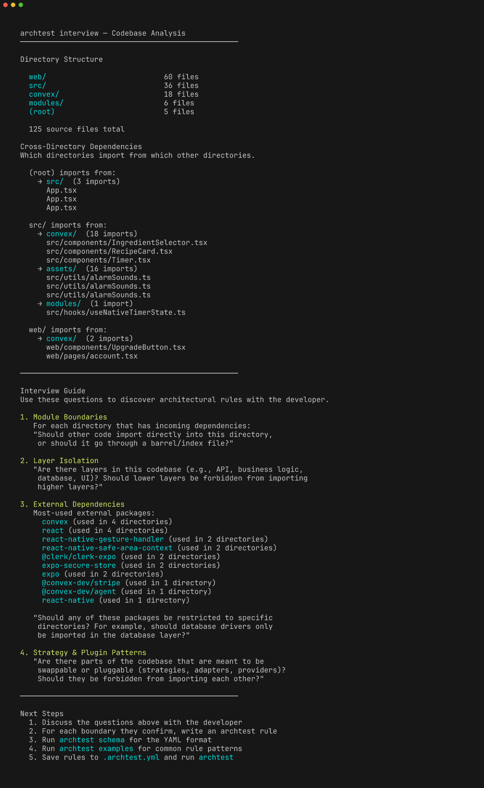

# archtest

Architectural drift detection through declarative rules. Any language with import statements.

Define boundaries in YAML. Enforce them with grep. Let your AI write the rules.

## The Problem

Everyone knows architectural rules. "The orchestrator shouldn't import strategy internals." "The database layer shouldn't know about the API." But nobody writes the checks because regex and glob patterns are tedious expert-level string manipulation.

So boundaries erode. With AI coding agents it's worse — they don't smell architectural intent, and after 20 incremental changes you have spaghetti.

## The Insight

LLMs write grep patterns like humans write sentences. The LLM authors the rules, the human reviews them, the test runner executes them. The human never touches regex.

<p align="center">
  
</p>

## Quick Start

Tell your AI coding agent:

> "Let's set up archtest to protect our architecture. Run `npx archtest interview` to scan the codebase, then ask me about the boundaries we should enforce."

The agent will:

1. Run `archtest interview` — the tool reports it needs `--ext` and `--import-pattern` flags
2. Figure out your language and provide the right flags (e.g. `--ext .go --import-pattern '^\s*"([^"]+)"'`)
3. Run the interview again — this time it scans imports and maps your directory structure
4. Ask you questions about which boundaries matter
5. Write `.archtest.yml` rules based on your answers (using `archtest schema` and `archtest examples`)
6. Run `archtest` to verify the rules pass (or catch existing violations)

<p align="center">
  
</p>

## Manual Setup

```
npx archtest init        # Creates a starter .archtest.yml
npx archtest schema      # Shows the YAML format reference
npx archtest examples    # Shows common rule patterns
```

Edit `.archtest.yml`, then run:

```
npx archtest             # Check rules, show failures
npx archtest --verbose   # Show all rules with per-file breakdown
```

## Example Rules

```yaml
scan:
  extensions: [.ts, .tsx]
  import-patterns:
    - 'require\s*\(\s*[''"]([^''"]+)[''"]\s*\)'
    - '(?:import|export)\s+.*?\s+from\s+[''"]([^''"]+)[''"]'
  skip-dirs: [vendor]

rules:
  - name: no-deep-imports-into-auth
    description: "Import auth/ only through its index, not internal files"
    scope:
      files: ["**/*.ts"]
      exclude: ["auth/**"]
    deny:
      patterns:
        - "from ['\"].*auth/(?!index)"

  - name: no-db-in-domain
    description: "Domain layer must not import database modules"
    scope:
      files: ["domain/**/*.ts"]
    deny:
      patterns:
        - "from ['\"].*database"
        - "prisma|knex|sequelize"
```

The `scan` section tells archtest which files to scan and how to extract imports. Both `extensions` and `import-patterns` are required. Save them in config so `archtest interview` works with no flags next time.

## Any Language

archtest works on any language with greppable import syntax. You provide `--ext` and `--import-pattern` (a regex where capture group 1 is the import target), and archtest does the rest.

```bash
# Go
archtest interview --ext .go --import-pattern '^\s*"([^"]+)"'

# Python
archtest interview --ext .py \
  --import-pattern 'from\s+(\S+)\s+import' \
  --import-pattern 'import\s+(\S+)'

# Kotlin / Java
archtest interview --ext .kt --import-pattern 'import\s+([\w.]+)'

# Clojure
archtest interview --ext .clj --import-pattern '\[([a-z][a-z0-9.-]+\.[a-z][a-z0-9.-]+)'

# Rust
archtest interview --ext .rs --import-pattern 'use\s+([\w:]+)'
```

Built-in hints exist for JS/TS, Go, Python, Rust, JVM, and Clojure — the tool suggests the right `--import-pattern` when it detects these languages. For everything else, your AI agent can figure out the pattern from a sample import line.

## Monorepos

Each sub-project can have its own `.archtest.yml` with different scan settings. Config lookup cascades upward from `--base-dir` to the repo root — nearest config wins.

```
my-monorepo/
  backend/.archtest.yml     # extensions: [.clj], import-patterns for Clojure
  mobile/.archtest.yml      # extensions: [.ts, .tsx], import-patterns for JS/TS
  .archtest.yml             # shared rules (optional)
```

```bash
archtest interview --base-dir backend/    # Uses backend/.archtest.yml
archtest interview --base-dir mobile/     # Uses mobile/.archtest.yml
```

## CI Integration

archtest exits with code 1 on failure — add it to your test pipeline:

```json
{
  "scripts": {
    "test": "vitest && archtest"
  }
}
```

## CLI Reference

| Command | Description |
|---|---|
| `archtest` | Run rules against the codebase |
| `archtest --verbose` | Show all rules and per-file breakdown |
| `archtest --config <path>` | Use a specific rule file |
| `archtest interview` | Scan codebase and generate an architectural interview |
| `archtest schema` | Show the YAML rule file schema |
| `archtest examples` | Show example rules for common patterns |
| `archtest init` | Generate a starter .archtest.yml |

## Install

```
npm install archtest
```

Or run directly without installing:

```
npx archtest
```

## Philosophy

archtest is an **AI-first tool**. The AI coding agent is the primary interface — it writes the rules, runs the checks, and fixes violations. The human defines intent ("these modules should be independent") and reviews the generated rules.

The rule file is the contract between human intent and machine enforcement. It's human-readable YAML so anyone can review it, but the regex patterns inside are written by AI because that's what AI is good at.

Rules run deterministically with zero AI at runtime. No LLM calls during `archtest` — it's pure grep. Fast, predictable, cacheable, CI-friendly.

## License

MIT
